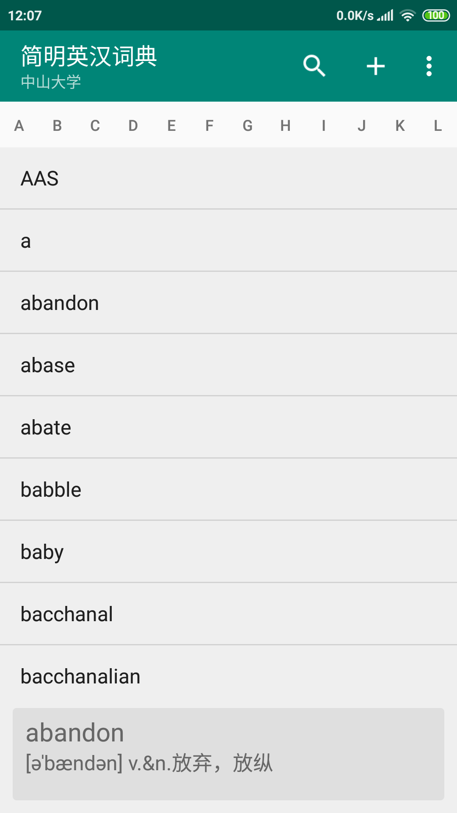
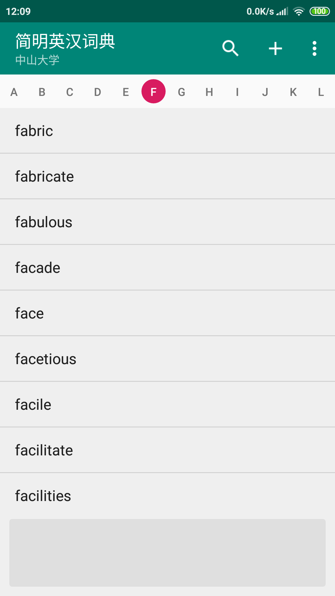
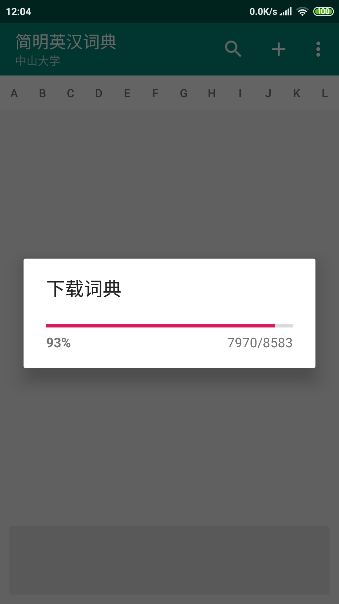

# GrandDictionary

简明英汉词典

**Usage**

- Use Android Studio to build the app
- Click menu item->Download to download dictionary data from remote server
- Select top letter index to show all words with the leader letter

**Requirements**

- Android Studio 3.5+
- JDK 8
- Android SDK 29
- Supports API Level 15+

**Libraries**

- [Support libraries]: androidx / appcompat / recyclerview / constraintlayout
- Square [OkHttp]

**Screenshots**

<!--
<figure class="third" align="center">
    
    
    
</figure>
-->

  

[Support libraries]: https://developer.android.com/jetpack/androidx/
[Okhttp]: https://github.com/square/okhttp
